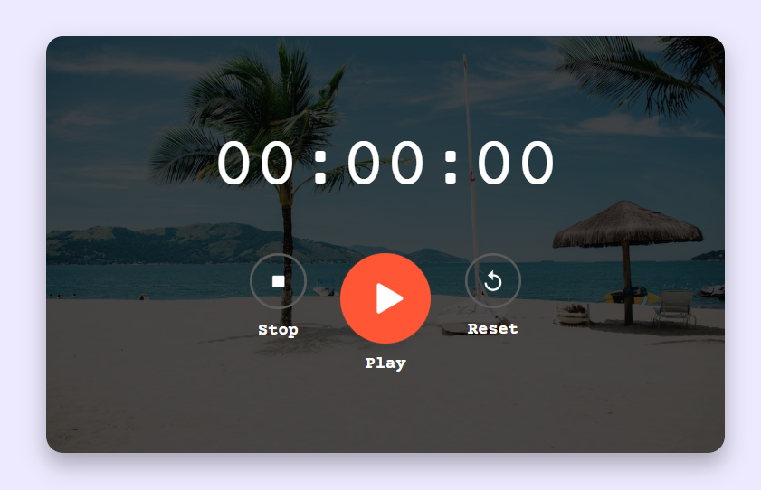

# Stopwatch App

A simple and responsive Stopwatch App built using HTML, CSS, and JavaScript. The application allows users to start, stop, and reset time with an attractive user interface and real-time updates.

## 📸 Project Preview



## Features

- Start the stopwatch
- Stop/Pause the stopwatch
- Reset the stopwatch
- Displays time in Hours : Minutes : Seconds format
- Responsive design
- Attractive background image
- Simple and user-friendly interface

## Technologies Used

- HTML5
- CSS3
- JavaScript

## How It Works

1. Click **Play** to start the stopwatch.
2. Click **Stop** to pause the timer.
3. Click **Reset** to reset the timer to `00:00:00`.
4. Time updates automatically every second.

## Concepts Used

- DOM Manipulation
- Functions
- Event Handling
- JavaScript Timers
- `setInterval()`
- `clearInterval()`
- Array Destructuring
- Conditional Statements

## Project Structure

```text
Stop-Watch
│
├── index.html
├── style.css
├── script.js
├── README.md
│
└── images
    ├── background.png
    ├── start.png
    ├── stop.png
    └── reset.png